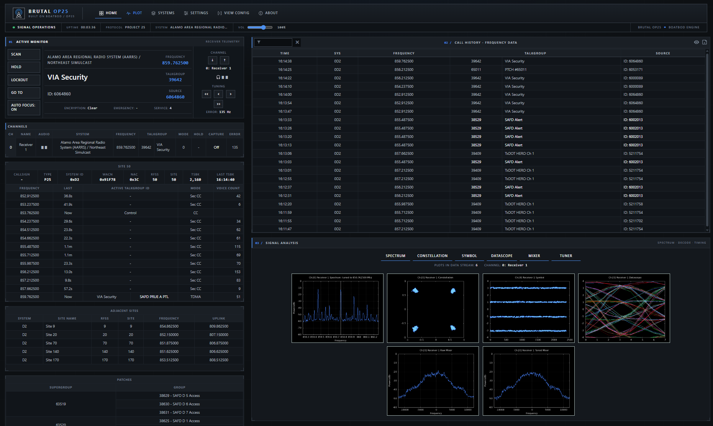
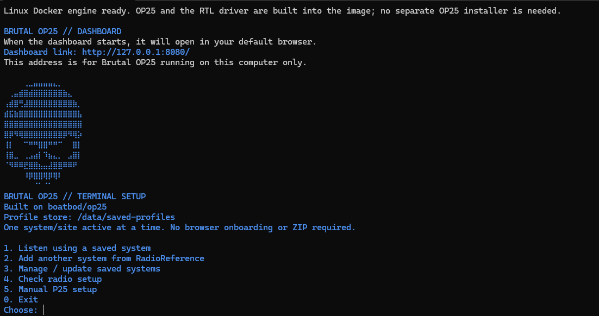

# Brutal OP25

Dark, ops-style dashboard and guided launcher for monitoring P25 trunked radio, built on
[boatbod/op25](https://github.com/boatbod/op25). Receive-only.

> Status: `0.3.0-dev`. Clear reception was verified with an RTL-SDR Blog V4 on the earlier Docker Desktop path. The new Ubuntu WSL Engine path has decoded a live P25 control channel; its browser audio still needs a listening check. RSPdx-R2 signal lock and audio are not yet verified.

## Screenshots

Live dashboard showing the receiver, call history, and signal plots:



Terminal setup with its local dashboard link:



## What it adds on top of OP25
- **Guided launch** (Windows and Linux/WSL): picks your radio, forwards USB into a locked-down container, and opens the dashboard.
- **Terminal onboarding**: choose a radio, then save the first P25 system or skip importing and open the dashboard's Systems panel. Nothing listens until a saved system and connected radio are selected.
- **Brutal dashboard theme**: one graphite palette and one accent colour, flat plot tabs, live status strip, tower logo.
- **Systems panel** (in the dashboard): add systems from RadioReference or manually, switch between saved systems (the receiver restarts for a few seconds), remove them. Saved systems are shared with the terminal menu.
- **Additional SDR profiles** (terminal menu option 6): copy a saved system, site, talkgroups, and listening preferences to another radio without a fresh install or another RadioReference login. Only one physical radio receives at a time; stop and relaunch to change SDRs.
- **Listening controls** (in the same panel): mark talkgroups **Priority** (they interrupt lower-priority calls) or **Blocked**, filter by RadioReference category, listen only to your Priority talkgroups, name individual radios (click any ID on the dashboard), choose how encrypted talkgroups are handled, and set the hold time. Changes are saved as a new version of the system and the receiver restarts for a few seconds.
- **Volume slider** for browser audio in the status strip.
- **Supervisor** (`brutal_supervisor.py`): keeps OP25 behind a small control server, shows a recovery page if OP25 stops, and never exposes Docker or USB control.
- **Browser-friendly**: plot frames are not cached and stop downloading when hidden; call-history and subscriber tables are capped.

## Requirements
- x86-64 Windows 10/11 with WSL 2 support, or x86-64 Linux. Windows setup installs Ubuntu 24.04 in WSL and Docker Engine inside Ubuntu; Docker Desktop and a Docker account are not needed.
- Windows uses built-in PowerShell for initial WSL setup and the USB bridge (`usbipd-win`, hash- and signature-verified). Linux runs OP25, Docker, onboarding, and the dashboard. Windows administrator approval may be needed for WSL or first-time USB sharing.
- An RTL-SDR (including Blog V4) or, with a locally built private addon, an SDRplay RSPdx-R2.
- Optional: a RadioReference Premium account for imports. Users enter their own credentials; prebuilt releases include the client application key (see [key distribution and privacy](docs/INSTALLATION-PRIVACY.txt)).

No Docker Scout login is part of setup. Normal local builds use public upstream packages and images; anonymous registry rate limits can still apply.

## Install and run (development preview)
The installer downloads this repository and the prebuilt receiver image. Git, Docker Desktop, and a Docker account are not required. Copy and paste the command for your system once:

Windows PowerShell:

```powershell
$installer = Join-Path $env:TEMP 'Install-Brutal-OP25.ps1'; Invoke-WebRequest 'https://raw.githubusercontent.com/trappedinthesim/brutal-op25/main/bootstrap/Install-Brutal-OP25.ps1' -OutFile $installer; powershell.exe -NoProfile -ExecutionPolicy Bypass -File $installer
```

Native Linux terminal:

```bash
curl -fsSL https://raw.githubusercontent.com/trappedinthesim/brutal-op25/main/bootstrap/install-brutal-op25.sh -o /tmp/install-brutal-op25.sh && bash /tmp/install-brutal-op25.sh
```

On later runs, search the Windows Start menu for **Brutal OP25**, or on native Linux open a terminal and type `brutal-op25`. Setup creates these personal launchers without administrator access or shell-profile changes. On Linux, `~/.local/bin` may not join your `PATH` until your next login; `~/.local/bin/brutal-op25` works immediately. The commands below remain as fallbacks if a shortcut could not be created:

Windows PowerShell:

```powershell
& (Join-Path $env:LOCALAPPDATA 'BrutalOP25\Launch-Brutal-OP25.cmd')
```

Native Linux terminal:

```bash
bash "$HOME/brutal-op25/install-brutal-op25.sh"
```

Rerun the downloaded bootstrap with `-Update` (Windows) or `--update` (Linux) for program updates. Updates are explicit; the launcher never silently replaces a working version. A failed update restores the previous program folder. Saved systems live in a separate Docker volume, not in the program folder.

For an explicit image refresh after a source update, run `Launch-Brutal-OP25.cmd --update-image` on Windows or `bash install-brutal-op25.sh --update-image` on Linux. A failed pull leaves the current image in place; a successful update keeps the prior image under a `-previous` tag. Use `--rollback-image` if you need to revert. Stop the receiver before updating.

Back up saved systems while the receiver is stopped: `Launch-Brutal-OP25.cmd --backup` writes a ZIP into **Documents / Brutal OP25 Backups** on Windows; `bash install-brutal-op25.sh --backup` writes under `~/.local/share/brutal-op25/backups` on Linux. Restore with `Launch-Brutal-OP25.cmd --restore "C:\path\to\systems.zip"` or `bash install-brutal-op25.sh --restore /full/path/systems.zip`. Restore never overwrites a different saved system with the same ID. Receiver cache and RadioReference credentials are not in the backup.

The Ubuntu WSL Engine has its own volume. Profiles previously saved under Docker Desktop are not migrated automatically; new installs start fresh. No existing Docker Desktop images or volumes are deleted by this installer.

The `bootstrap/` scripts install or update from GitHub's source archive without Git or SSH. They download to a temporary directory, verify the expected launcher and image reference, prepare the image, and keep the previous program folder on update. Windows setup asks before installing Ubuntu WSL and Docker Engine and leaves required Windows/WSL approval prompts visible. These commands have been tested against local archives; clean-host delivery and RSPdx-R2 reception still need production testing.

Both entrypoints check prerequisites, fetch the versioned prebuilt RTL image when available, otherwise build from this repository, detect a single connected radio automatically, and enter the terminal setup. On Windows, the USB bridge forwards only the selected radio into Ubuntu WSL; Docker Desktop is not started. On supported Ubuntu 22.04/24.04/26.04 or Debian 12/13, the Linux installer can add Docker's official apt repository and Engine; it uses `sudo` rather than granting root-equivalent docker-group membership. Other Linux distributions can run the launcher after installing their own local Docker Engine. No separate OP25 or RTL-SDR driver install is required on the host.

Returning users run the Start-menu shortcut or personal Linux command and reuse their local image; updates are never silently pulled over a working version. `--check` on either installer checks prerequisites without changing anything; `--prepare-only` sets up Docker and the base image without entering radio setup. Native Linux users can also use `bash brutal-op25.sh --no-usb` for imports only, or `bash brutal-op25.sh --build` to force a source build. WSL users can run `bash install-brutal-op25.sh` for the same guided Ubuntu/USB path.

The first RSPdx-R2 connection downloads SDRplay's Linux API from the vendor, verifies a pinned SHA-256, presents the full license in a scrollable terminal pager, and builds a private local addon only after the user types **ACCEPT**. Mistyped consent is retried rather than restarting setup. Cancelling leaves the saved profile intact: choose **Listen using a saved system** to retry. The addon is rebuilt after a base-image update, with a fresh license review. It cannot be bundled into a public image; a future vendor update may require a new verified checksum. RTL-SDR users never see the SDRplay license.

The terminal can save the first system or open Systems in the dashboard to add several there. To test a second SDR against an existing system, use **Add another SDR to a saved system** in the terminal menu; it leaves the first radio profile unchanged and reuses an equivalent profile on retry instead of making duplicates.
The live dashboard opens at `http://127.0.0.1:8080/` (bound to this computer only). Use **Systems** there to add more RadioReference or manual systems and switch between them. Only one system/site receives at a time. The browser cannot install drivers or forward USB.

The prebuilt release includes a **recoverable** client application key, so users only enter their own RadioReference credentials. Their credentials go directly from their local container to RadioReference; they are not sent to a Brutal OP25 server. Compiling the key into the image does not make it secret. Local source builds without that helper can still use `.setup-cache/radioreference_app_key` (git-ignored) or `BRUTAL_RR_APP_KEY`; the launchers supply those only at runtime. See [key distribution and privacy](docs/INSTALLATION-PRIVACY.txt) before sharing an image.

SDRplay RSPdx-R2: SDRplay's driver cannot be redistributed. The launcher builds a private local image only after you review and accept SDRplay's license. `install/build-sdrplay.sh` remains available for manually obtained official installers.

## Develop
An `image-v<version>` Git tag triggers `.github/workflows/image.yml`: it checks the version against `build/image-release.txt`, takes the application key from the repository's `BRUTAL_RR_APP_KEY` Actions secret through a temporary BuildKit secret mount, compiles the client helper, runs tests, and publishes to GitHub Container Registry using `GITHUB_TOKEN`. The workflow fails if that secret is absent. The SDRplay addon and user credentials are never published; the release image does contain a recoverable app key.

Manual base-image build from this checkout (the guided launchers do this automatically when needed):

    docker build -f build/Dockerfile -t brutal-op25:0.3.0-dev.4 .

Quick refresh of an already-built image after editing app files (keeps installed drivers):

    docker build -f build/Dockerfile.refresh --build-arg INSTALLED_IMAGE=brutal-op25:0.3.0-dev.4 -t brutal-op25:0.3.0-dev.4 .

Tests run inside the image (the dashboard patches target the upstream UI shipped there). The test runner mounts only the named source/test folders and files, never `.setup-cache` or the whole checkout:

    bash tests/run-container-tests.sh

On Windows, run that command inside the Ubuntu WSL distribution. The Windows launcher also has a read-only prerequisite check: `Launch-Brutal-OP25.cmd --check`.

`brutal-op25.sh --no-usb` is for terminal import/management only; it cannot start listening.

| Folder / file | Purpose |
|---|---|
| `Launch-Brutal-OP25.cmd`, `install-brutal-op25.sh`, `brutal-op25.sh` | Windows and Linux entrypoints; these are the files users run |
| `bootstrap/` | Git-free public install/update scripts, activated when the repo and image are public |
| `src/` | Receiver, terminal onboarding, RadioReference import, and dashboard source/assets |
| `install/` | Host-specific prerequisite, USB, shortcut, and image bootstrap helpers |
| `build/` | Dockerfiles, pinned upstream patches, dependencies, and release image reference |
| `tests/`, `tools/`, `docs/` | Automated checks, optional developer tools, and project notes |

See [operating notes](docs/BRUTAL-OP25.txt), [tested hardware boundaries](docs/SDR-SUPPORT.txt), [installation privacy](docs/INSTALLATION-PRIVACY.txt), and the [public-release checklist](docs/RELEASE-CHECKLIST.md).

## Upstream tracking
Pinned to boatbod/op25 commit `71abcd0` (2026-08-23). On 2026-10-03 that was the tip of upstream `master`, so no stable
update was pending. Upstream's experimental `dev2` branch (Sep-Oct 2026) is a rewrite in progress (retires DMR/D-STAR/NXDN,
decouples talkgroups from sites, splits streams from receivers). This project's patches still apply to it as text, but the
generated receiver config has not been tested against it, so it is not adopted.

To move to a newer upstream commit: change `OP25_COMMIT` in `build/Dockerfile` and `UPSTREAM_COMMIT` in `src/brutal_ui.py` (a test keeps
the two in step), rebuild the base image, then run the tests. The patches in `src/brutal_ui.py` and `src/brutal_runtime.py` fail
closed: if upstream changed the code they target, the receiver refuses to start instead of running half-patched. The SDRplay
addon image is built from the base image, so it must be rebuilt (with its license accepted by you) after a bump.

## Credits and license
Built on [boatbod/op25](https://github.com/boatbod/op25), itself derived from the original
[osmocom OP25](https://git.osmocom.org/op25); thanks to its authors. This project is not affiliated with or
endorsed by them. Brutal OP25's original code is licensed under
[GPL-3.0-or-later](LICENSE). Upstream components keep their own copyrights and
licenses; see [third-party notices and exact source revisions](THIRD-PARTY-NOTICES.md).
Encrypted voice cannot be decoded. Hardware presets are starting points, not proof of reception.
